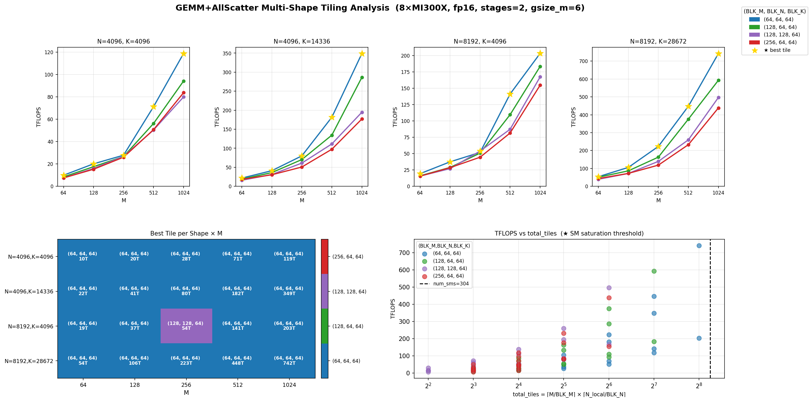
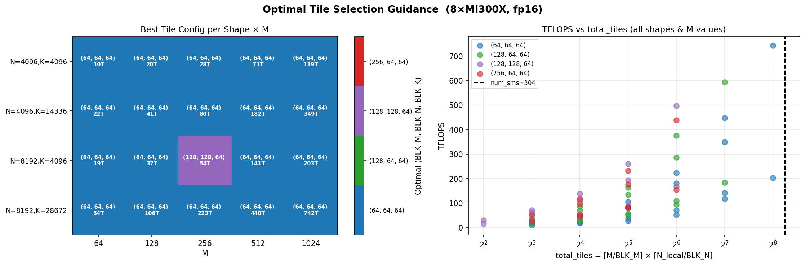

# GEMM + AllScatter Multi-Shape Tiling Analysis

## Hardware & Configuration

- **Hardware**: 8x AMD MI300X (304 CUs each)
- **Datatype**: fp16
- **GPUs**: 8 (N_local = N / 8 per rank)
- **Fixed**: `num_stages=2`, `gsize_m=6` (established as optimal from first sweep)
- **Benchmark script**: `benchmark/examples/benchmark_gemm_all_scatter_tiling_sweep.py`

## Summary Charts

### Combined Analysis (TFLOPS per shape + optimal tile heatmap + total_tiles guidance)



### Optimal Tile Heatmap + SM Saturation



---

## Problem Shapes Tested

Four LLM-representative shapes (all N, K divisible by 8), sweeping M ∈ {64, 128, 256, 512, 1024}:

| Shape label   | N     | K     | Typical use case              |
|---------------|-------|-------|-------------------------------|
| N4096, K4096  | 4096  | 4096  | Small / attention projection  |
| N4096, K14336 | 4096  | 14336 | Mistral-7B FF down-proj       |
| N8192, K4096  | 8192  | 4096  | Llama-2-70B down-proj         |
| N8192, K28672 | 8192  | 28672 | Llama-2-70B gate/up proj      |

---

## Results by Shape

### N=4096, K=4096

| M    | (64,64,64) | (128,64,64) | (128,128,64) | (256,64,64) | **Best** | **Best TFLOPS** |
|------|-----------|------------|-------------|------------|----------|-----------------|
| 64   | 9.9       | 8.4        | 7.5         | 7.5        | (64,64,64) | 9.9 TFLOPS (0.218 ms) |
| 128  | 20.1      | 17.5       | 15.9        | 15.2       | (64,64,64) | 20.1 TFLOPS (0.214 ms) |
| 256  | 27.8      | 26.6       | 26.7        | 26.0       | (64,64,64) | 27.8 TFLOPS (0.309 ms) |
| 512  | 71.2      | 56.2       | 50.4        | 50.6       | (64,64,64) | 71.2 TFLOPS (0.241 ms) |
| 1024 | 118.7     | 94.1       | 79.9        | 83.7       | (64,64,64) | 118.7 TFLOPS (0.289 ms) |

### N=4096, K=14336

| M    | (64,64,64) | (128,64,64) | (128,128,64) | (256,64,64) | **Best** | **Best TFLOPS** |
|------|-----------|------------|-------------|------------|----------|-----------------|
| 64   | 21.6      | 18.9       | 15.8        | 18.1       | (64,64,64) | 21.6 TFLOPS (0.347 ms) |
| 128  | 41.0      | 36.0       | 31.1        | 30.3       | (64,64,64) | 41.0 TFLOPS (0.367 ms) |
| 256  | 80.0      | 70.3       | 61.0        | 50.7       | (64,64,64) | 80.0 TFLOPS (0.376 ms) |
| 512  | 181.6     | 134.4      | 111.4       | 97.4       | (64,64,64) | 181.6 TFLOPS (0.331 ms) |
| 1024 | 348.9     | 286.3      | 194.7       | 176.9      | (64,64,64) | 348.9 TFLOPS (0.345 ms) |

### N=8192, K=4096

| M    | (64,64,64) | (128,64,64) | (128,128,64) | (256,64,64) | **Best** | **Best TFLOPS** |
|------|-----------|------------|-------------|------------|----------|-----------------|
| 64   | 19.3      | 16.1       | 15.7        | 15.5       | (64,64,64) | 19.3 TFLOPS (0.222 ms) |
| 128  | 37.5      | 28.9       | 27.1        | 28.5       | (64,64,64) | 37.5 TFLOPS (0.229 ms) |
| 256  | 51.9      | 50.8       | 53.9        | 44.5       | **(128,128,64)** | 53.9 TFLOPS (0.318 ms) |
| 512  | 141.3     | 109.7      | 87.3        | 81.6       | (64,64,64) | 141.3 TFLOPS (0.243 ms) |
| 1024 | 203.5     | 183.5      | 167.5       | 154.8      | (64,64,64) | 203.5 TFLOPS (0.338 ms) |

### N=8192, K=28672

| M    | (64,64,64) | (128,64,64) | (128,128,64) | (256,64,64) | **Best** | **Best TFLOPS** |
|------|-----------|------------|-------------|------------|----------|-----------------|
| 64   | 53.7      | 50.6       | 39.2        | 43.3       | (64,64,64) | 53.7 TFLOPS (0.560 ms) |
| 128  | 105.6     | 86.4       | 71.9        | 72.2       | (64,64,64) | 105.6 TFLOPS (0.569 ms) |
| 256  | 223.0     | 163.2      | 139.4       | 118.4      | (64,64,64) | 223.0 TFLOPS (0.539 ms) |
| 512  | 447.8     | 375.8      | 259.9       | 232.8      | (64,64,64) | 447.8 TFLOPS (0.537 ms) |
| 1024 | 742.5     | 592.9      | 496.8       | 438.4      | (64,64,64) | **742.5 TFLOPS** (0.648 ms) |

---

## How to Determine Optimal Tiling Parameters

The key predictor is **`total_tiles`** — the number of independent output tiles the kernel can distribute across all 304 SMs:

```
N_local    = N / world_size          # output columns owned by this rank
total_tiles = ceil(M / BLK_M) * ceil(N_local / BLK_N)
```

### Rule of thumb

| Condition | Recommendation | Reason |
|-----------|----------------|--------|
| `total_tiles < num_sms` (304) | Use smaller tile `(64,64,64)` | SMs are starved; smaller tiles = more tiles = higher occupancy |
| `total_tiles ≈ num_sms` | `(64,64,64)` or `(128,64,64)` | Transition zone; test both |
| `total_tiles >> num_sms` | Any tile works; `(128,64,64)` often strong | Compute-bound; larger tiles reduce register pressure |

### Quick-reference formula

```python
N_local     = N // world_size
total_tiles = math.ceil(M / BLK_M) * math.ceil(N_local / BLK_N)

if total_tiles < num_sms:
    BLK_M, BLK_N, BLK_K = 64, 64, 64    # small tile: maximize SM utilization
elif total_tiles < 4 * num_sms:
    BLK_M, BLK_N, BLK_K = 128, 64, 64   # medium tile: balance occupancy vs compute
else:
    BLK_M, BLK_N, BLK_K = 128, 64, 64   # still good; (256,64,64) rarely helps
```

### Why `(64,64,64)` dominates almost everywhere

For N=4096 with 8 GPUs: `N_local = 512`.

| Tile       | total_tiles (M=256) | total_tiles (M=1024) |
|------------|--------------------:|---------------------:|
| (64,64,64) | ceil(256/64)×ceil(512/64) = **4×8 = 32** | 16×8 = 128 |
| (128,64,64)| 2×8 = **16**       | 8×8 = 64              |
| (256,64,64)| 1×8 = **8**        | 4×8 = 32              |

At M=256, even `(64,64,64)` only generates 32 tiles for 304 SMs — all configs are SM-starved.
`(64,64,64)` wins because it generates the most tiles, keeping more SMs busy longer.

The single exception is `N=8192, K=4096, M=256` where `(128,128,64)` wins:
`N_local=1024` → tiles = ceil(256/128)×ceil(1024/128) = 2×8 = 16 for `(128,128,64)` vs 4×16 = 64 for `(64,64,64)`.
Both are below 304, but the larger square tile provides better L1/SRAM reuse for the squarer output, overcoming the occupancy disadvantage.

### Guidelines summary

| Parameter | Recommendation |
|-----------|----------------|
| `BLK_M`   | **64** unless `total_tiles` with BLK_M=64 is already >> num_sms; then try 128 |
| `BLK_N`   | **64** matches `N_local` granularity for 8 GPUs (512 or 1024); try 128 only for square outputs |
| `BLK_K`   | **64** is universally good; larger values only help if K >> 4096 and stages allow |
| `num_stages` | **2** always; stages=3 exceeds MI300X 64 KB LDS for BLK_M≥128 |
| `gsize_m` | **6–8**; has < 5% impact — leave at default |
