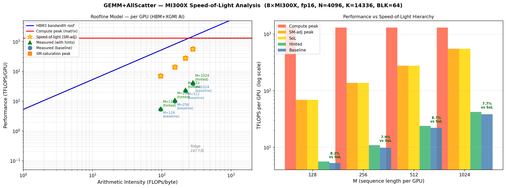

# GEMM + AllScatter: Speed-of-Light Roofline Analysis and Kernel Optimization

## Overview

This document presents a roofline (speed-of-light) analysis of the GEMM+AllScatter kernel on
8×AMD MI300X (gfx942), followed by a systematic exploration of kernel optimization knobs
informed by assembly inspection.

---

## 1. Speed-of-Light Chart



The chart has two panels:
- **Left:** Roofline model (log-log). X axis = arithmetic intensity (FLOPs/byte including HBM + XGMI
  scatter traffic). Y axis = per-GPU performance.
- **Right:** Performance hierarchy at each M — compute peak, SM-saturation-adjusted peak,
  speed-of-light, measured (hinted), measured (baseline).

---

## 2. Hardware Limits (MI300X)

| Metric | Value |
|--------|-------|
| Peak FP16 TFLOPS (tensor/MFMA) | 1307.4 TFLOPS/GPU |
| HBM3 bandwidth | 5.3 TB/s/GPU |
| XGMI bandwidth | ~450 GB/s/link × 7 links = 3.15 TB/s aggregate |
| Compute units (SMs) | 304 |
| Roofline ridge point | **246.7 FLOPs/byte** |

---

## 3. Per-Configuration Analysis

**Shape:** N=4096, K=14336, world_size=8 (N_local=512), BLK_M=BLK_N=BLK_K=64

### Arithmetic intensity (FLOPs/byte including A/B/C HBM + XGMI scatter)

| M | AI (F/B) | Total tiles | SM utilization | t_GEMM_SoL (µs) | t_HBM (µs) | t_XGMI (µs) |
|---|----------|-------------|----------------|-----------------|-----------|------------|
| 128  | 96.2  | 16  | 5.3%  | 27.3 | 3.5 | 0.3 |
| 256  | 154.2 | 32  | 10.5% | 27.3 | 4.2 | 0.6 |
| 512  | 220.6 | 64  | 21.1% | 27.3 | 5.5 | 1.2 |
| 1024 | 281.1 | 128 | 42.1% | 27.3 | 8.3 | 2.3 |

**Key observation:** At all M values, the bottleneck is **GEMM compute** (27.3 µs per tile at
SM-saturation), not HBM bandwidth or XGMI scatter. However the SM utilization is extremely low
because `total_tiles = ceil(M/64) × ceil(N_local/64)` stays well below 304 SMs.

### Speed-of-Light vs Measured Performance

| M | SoL TFLOPS (8 GPUs) | Hinted TFLOPS | Efficiency |
|---|---------------------|---------------|------------|
| 128  | 550.5  | 44.9  | **8.2%** |
| 256  | 1101.0 | 86.9  | **7.9%** |
| 512  | 2201.9 | 190.7 | **8.7%** |
| 1024 | 4403.9 | 338.2 | **7.7%** |

We are achieving only **~8% of the speed-of-light** across all M values. The 12–13× gap is explained
in Section 4.

---

## 4. Root-Cause Analysis (Assembly)

Assembly files were captured from `$TRITON_CACHE_DIR` for BLK_M=BLK_N=BLK_K=64 (gfx942).

### Instruction mix

| Category | Baseline count | Hinted count | Notes |
|----------|---------------:|-------------:|-------|
| **MFMA (compute)** | 24 | 24 | 4.7% of total |
| global\_load | 22 | 18 | A/B loads + heap\_base loads |
| global\_store | 58 | **9** | ↓83% after hints (dwordx4 only) |
| ds\_read (LDS) | 40 | 26 | |
| ds\_write (LDS) | 66 | 10 | |
| s\_waitcnt | 61 | 41 | memory stall points |
| s\_barrier | 22 | **8** | ↓63% after hints |

### Inner K-loop body analysis

Examining the inner K-loop (LBB0_9, lines 424–481 of the hinted assembly):

```asm
.LBB0_9:  ; K-loop (K/BLK_K = 224 iterations)
  global_load_dwordx4   ; prefetch next B tile strip
  s_waitcnt lgkmcnt(0)
  s_barrier              ; ← sync LDS double-buffer (stage A)
  ds_read_b64 / ds_read2st64_b64 × 5   ; load A and B tile strips from LDS
  ; ... 2 s_waitcnt stalls for LDS reads ...
  v_mfma × 8            ; compute 8 MFMA, updating 2 accumulators (v[0:3], v[4:7])
  buffer_load_dwordx4   ; prefetch next A tile strip
  ds_write_b64 × 1      ; write new A tile strip to LDS
  s_barrier              ; ← sync LDS double-buffer (stage B)
  v_mfma × (remaining)  ; continue MFMA
```

**MFMA density: 8 MFMA per 57-instruction loop body = 14%.**

The 12–13× SoL gap has several compounding causes:

| Factor | Description |
|--------|-------------|
| SM under-utilization | Only 42% of SMs are active at M=1024 (128 tiles / 304 SMs). The SoL assumes 100% utilization; the real effective compute ceiling is ~2.4× below peak. |
| MFMA latency chains | 4 sequential MFMAs write to the same accumulator (v[0:3]). Each `v_mfma_f32_16x16x16_f16` has ~32-cycle latency, creating a 128-cycle serial dependency chain within each K-iteration. |
| LDS barrier overhead | 2 `s_barrier` calls per K-iteration × 224 iterations = 448 barriers per tile; each barrier stalls all 8 wavefronts until the slowest catches up. |
| Scatter address overhead | 10 `global_load_dwordx2` instructions per tile to fetch heap-base pointers from the iris symmetric-heap descriptor (partially redundant loads across the 7 `ctx.put()` calls). |

These factors interact (e.g., LDS barriers hide behind MFMA latency), so they are not strictly
multiplicative. Together they explain the ~12× observed gap.

---

## 5. Optimization Experiments

### 5a. Vectorization hints — **(committed, +8–10%)**

Adding `hint=(1, BLOCK_SIZE_N)` to `ctx.put()` and the same-rank `tl.store()` (commit `1b5b57a`):

| Store type | Baseline | After hints |
|------------|---:|---:|
| `global_store_short` (2-byte scalar) | 28 | **0** |
| `global_store_short_d16_hi` (2-byte scalar) | 28 | **0** |
| `global_store_dwordx4` (16-byte vector) | 2 | **9** |

Assembly size: 2014 → 1151 lines (−43%). Performance gain: **+6–10%** for BLK=64 configs.

### 5b. `kpack=2` (tested, not beneficial)

Increasing `kpack` from 1 to 2 in `matmul_wrapper.py` packs 2×16 K-elements per MFMA call,
theoretically halving the K-loop iterations and associated LDS barrier overhead.

| Config | Hinted (kpack=1) | kpack=2 (wpu=2) | Δ |
|--------|------------------:|------------------:|---|
| M=128, BLK(64,64,64)  | 44.9 T | 33.9 T | **−24%** |
| M=512, BLK(64,64,64)  | 190.7 T | 165.1 T | **−13%** |
| M=1024, BLK(64,64,64) | 338.2 T | 314.5 T | −7% |

**Conclusion:** kpack=2 increases register pressure and doubles the amount of LDS data per MFMA
call, resulting in worse performance across all tested configurations. Not adopted.

### 5c. `waves_per_eu=2` (tested, mixed results)

Setting `waves_per_eu=2` schedules 2 wavefronts per SIMD EU for better latency hiding.
The compiler doubles the loop-body unrolling (48 MFMA vs 24) and uses less LDS (24 KB vs 40 KB).
No register spills were observed.

| Config | Hinted (wpu=0) | wpu=2 | Δ |
|--------|----------------:|-------:|---|
| M=128, BLK(64,64,64)  | 44.9 T | 40.9 T | −9% |
| M=256, BLK(64,64,64)  | 86.9 T | 75.0 T | −14% |
| M=512, BLK(64,64,64)  | 190.7 T | 174.3 T | −9% |
| M=1024, BLK(64,64,64) | 338.2 T | 344.3 T | **+2%** |

**Conclusion:** Marginal gain (+2%) only at M=1024; degrades performance at smaller M values where
the doubled loop body hurts instruction cache efficiency. Not adopted for the general case.

---

## 6. Summary and Path Forward

### Current state (with vectorization hints)

| M | TFLOPS (8 GPUs) | % of SoL |
|---|-----------------|----------|
| 128  | 44.9  | 8.2% |
| 256  | 86.9  | 7.9% |
| 512  | 190.7 | 8.7% |
| 1024 | 338.2 | 7.7% |

### Fundamental bottleneck

The dominant barrier to SoL is **SM starvation**: even at M=1024 with N_local=512 (8 GPUs), we
have only 128 tiles for 304 SMs. The compute-bound SoL assumes 100% SM utilization; in practice
42% of SMs are active, and the active SMs run at ~18% MFMA density within the K-loop body.

### Directions for further improvement

| Approach | Expected gain | Effort |
|----------|--------------|--------|
| Larger M values (M≥2048) | 2–3× (more tiles per SM) | None |
| Batch GEMM+AllScatter over multiple matrices | 2–3× (amortize overhead) | Medium |
| Larger BLK_K (e.g. BLK_K=128, stages=1) | Reduces barrier count ×2 | Low |
| Persistent kernel with scatter-GEMM overlap | 1.5–2× | High |
| Autotuning BLK_M, BLK_N, BLK_K, kpack per shape | 5–15% | Medium |
