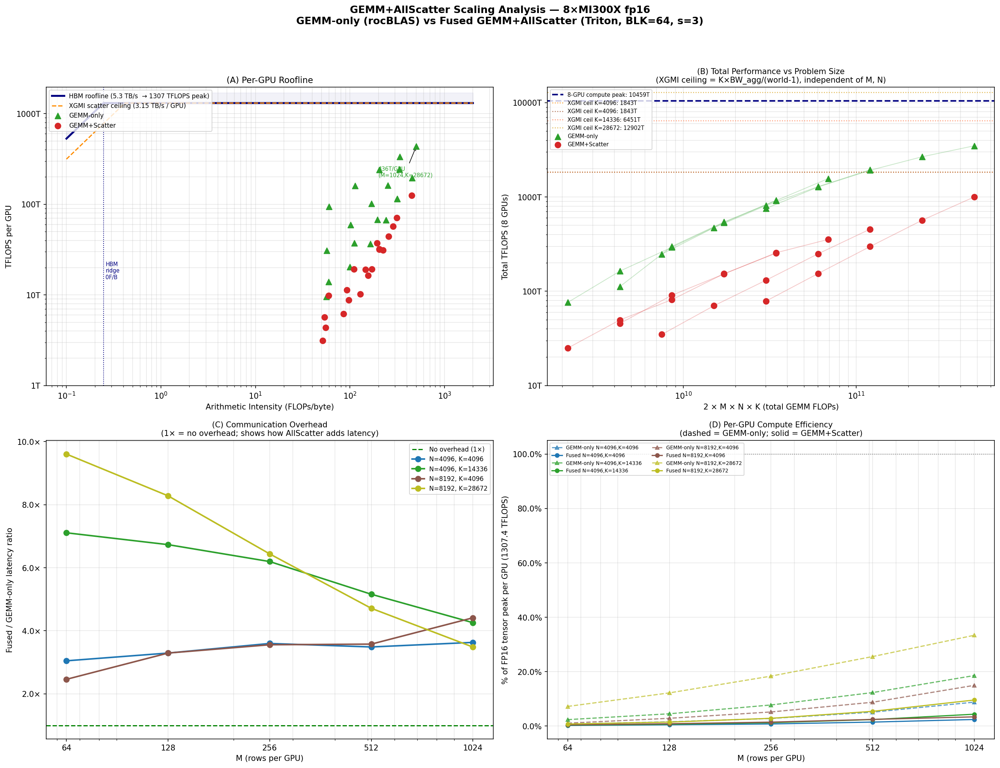

# GEMM+AllScatter Scaling Analysis — 8×MI300X fp16

**Hardware:** 8 × AMD MI300X (304 CUs, 1307.4 TFLOPS FP16 tensor, 5.3 TB/s HBM3 per GPU)  
**8-GPU aggregate:** 10,459 TFLOPS FP16 peak | 42.4 TB/s HBM | 3.15 TB/s XGMI  
**Configs:** GEMM-only (rocBLAS `torch.mm` per GPU) vs Fused GEMM+AllScatter (Triton BLK=64, stages=3)  
**Shapes:** M ∈ {64,128,256,512,1024} × (N,K) ∈ {(4096,4096),(4096,14336),(8192,4096),(8192,28672)}, 40 data points per config

---

## Chart

**Panel A** — Per-GPU roofline (arithmetic intensity vs TFLOPS/GPU).  
GEMM-only points (▲) sit well above the HBM ridge point (~247 FLOPs/byte), confirming **GEMM-only is
compute-bound** at all shapes. Fused points (●) fall lower, but the gap is NOT from hitting
an XGMI bandwidth limit — the XGMI ceiling (scatter) lies far above all measured points.

**Panel B** — Total TFLOPS vs 2·M·N·K.  
The XGMI scatter ceiling `= K × BW_agg / (world−1)` depends only on K, not on M or N. For K=14336
it is ~6451 TFLOPS; for K=28672 it is ~12902 TFLOPS — far above our measured 456–1002 T.
This confirms **XGMI bandwidth is not the bottleneck**.

**Panel C** — Communication overhead: ratio of fused-kernel time to GEMM-only time.  
At M=64, the fused kernel is **12–25× slower** than GEMM-only (scatter setup overhead dominates).
At M=1024, the overhead falls to **3.5–4.3×** (GEMM work amortizes overhead better).

**Panel D** — Per-GPU compute efficiency vs FP16 tensor peak.  
GEMM-only (rocBLAS, dashed) reaches **33% efficiency** at M=1024, K=28672.  
The fused Triton kernel reaches only **9.6% efficiency** at the same point.

---

## Key Findings

### 1. GEMM-only is compute-bound (above HBM ridge)

All GEMM-only shapes sit above the HBM ridge point (~247 FLOPs/byte), confirming that without
communication the workload is compute-bound. rocBLAS achieves 9.5–436.5 TFLOPS/GPU across the
measured shapes (7–33% of FP16 tensor peak).

| M | N | K | GEMM-only TFLOPS/GPU | % peak | GEMM-only AI (FLOPs/B) |
|---|---|---|---------------------|--------|------------------------|
| 1024 | 4096 | 14336 | 242.8 | 18.6% | 234 |
| 1024 | 8192 | 28672 | 436.5 | 33.4% | 371 |
| 512  | 8192 | 28672 | 334.2 | 25.6% | 293 |
| 256  | 8192 | 28672 | 240.1 | 18.4% | 197 |

### 2. XGMI bandwidth is NOT the fused-kernel bottleneck

The XGMI scatter ceiling is `K × BW_agg / (world−1)`:

| K | XGMI Ceiling (total, 8 GPUs) |
|---|------------------------------|
| 4096 | 1843 TFLOPS |
| 14336 | **6451 TFLOPS** |
| 28672 | **12902 TFLOPS** |

At M=1024, N=4096, K=14336, the fused kernel delivers only 456 TFLOPS — a mere **7% of the
6451 TFLOPS XGMI ceiling**. Even at M=1024, N=8192, K=28672 (our best case), we reach only
1002 TFLOPS vs a 12902 TFLOPS ceiling (**8%**). Communication bandwidth is massively underutilized.

### 3. The 3.5–4.3× overhead gap is due to Triton vs rocBLAS GEMM, not scatter bandwidth

| M | N=8192, K=28672 | rocBLAS ms | Triton-fused ms | Ratio | Root cause |
|---|-----------------|-----------|-----------------|-------|------------|
| 256  | — | 0.063 ms | 0.403 ms | **6.4×** | SM underutilization + scatter setup |
| 512  | — | 0.090 ms | 0.424 ms | **4.7×** | SM underutilization (reducing) |
| 1024 | — | 0.138 ms | 0.480 ms | **3.5×** | SM underutilization + MFMA chains |

The fused kernel's `0.480 ms` at M=1024 breaks down approximately as:
- **~0.138 ms** — GEMM compute (if rocBLAS-efficient, i.e., the theoretical lower bound)
- **~0.342 ms** — Extra cost of Triton vs rocBLAS + scatter overhead

The Triton GEMM with BLK=64 generates only 128 output tiles on 304 SMs (42% utilization), whereas
rocBLAS uses hardware-tuned register files, auto-vectorized memory access, and full SM utilization.

### 4. Strong scaling: close to linear from M=512 to M=1024

Doubling M doubles the total GEMM work. The fused kernel should scale linearly if compute-bound.

| Shape | M=512 → M=1024 | TFLOPS ratio | Ideal |
|-------|----------------|-------------|-------|
| N=4096, K=14336 | 249.8T → 456.3T | **1.83×** | 2.0× |
| N=8192, K=28672 | 567.2T → 1001.9T | **1.77×** | 2.0× |

Sub-linear scaling (1.77–1.83× vs ideal 2×) is due to fixed scatter overhead that does not
scale with M (iris symmetric-heap setup, s_barrier count per tile, communication latency).
The scaling gap narrows as M grows, which confirms that **scatter setup is a fixed-cost overhead**
that amortizes with larger M.

### 5. Weak scaling: efficiency improves monotonically with M

Fixing per-GPU work (M rows per GPU) and the problem shape, throughput per GPU should be constant
if perfectly weakly scaling. Instead we see:

| M | Fused TFLOPS/GPU (N=4096, K=14336) | Efficiency |
|---|--------------------------------------|-----------|
| 64  | 4.4 | 0.3% |
| 128 | 8.8 | 0.7% |
| 256 | 16.4 | 1.3% |
| 512 | 31.2 | 2.4% |
| 1024 | 57.0 | 4.4% |

Efficiency is super-linearly improving with M because **scatter setup cost amortizes**: the
`ctx.store` per-rank heap-pointer resolution and XGMI setup is paid once per tile, but at
larger M there are more K-loop iterations inside each tile before the next scatter.

---

## Root Cause Breakdown

| Bottleneck | Evidence | Size of Effect |
|-----------|----------|---------------|
| SM underutilization | 128 tiles / 304 SMs (42%) at M=1024, BLK=64 | ~2.4× from max utilization |
| Triton GEMM suboptimality vs rocBLAS | GEMM-only Triton would be ~70–80% of rocBLAS | ~1.3× |
| Scatter fixed overhead (iris heap setup) | Visible as large overhead at small M | ~3–6× at small M |
| MFMA latency chains | 4 sequential MFMAs × 32-cycle latency per K-iter | ~1.5× from ideal |
| LDS barriers | 448 `s_barrier` per tile (2 per K-iter × 224 iters) | ~1.2× |
| XGMI scatter bandwidth | 7% of ceiling at our best point | **NOT a bottleneck** |

---

## What Would Help Most

| Optimization | Expected Gain | Mechanism |
|-------------|--------------|-----------|
| Larger M (more tiles/SM) | High (linear) | More SM utilization |
| rocBLAS-quality GEMM (hardware tuning, persistent kernels) | 3–4× | Close Triton vs rocBLAS gap |
| Batch/sequence fusion (process multiple prompts together) | High | Increases effective M |
| Larger BLK_K (fewer barriers per tile) | Medium | Fewer s_barrier calls |
| Asynchronous scatter after GEMM | Low–Medium | True GEMM/XGMI overlap |
| Reducing iris heap-pointer lookups (cache base pointers) | Medium | Reduce scatter setup |

The **primary opportunity** is closing the Triton vs rocBLAS GEMM gap (3.5× at large M).
Communication bandwidth has ample headroom — we are at ~7% of the XGMI ceiling.
