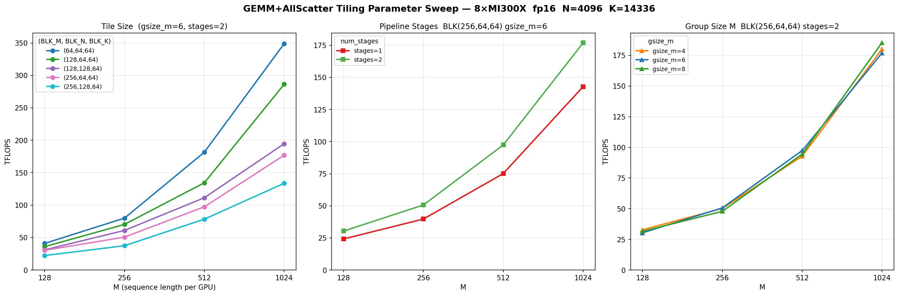

# GEMM + AllScatter Tiling Parameter Sweep Results

## Hardware & Configuration

- **Hardware**: 8x AMD MI300X (304 CUs each)
- **Datatype**: fp16
- **GPUs**: 8
- **Fixed dims**: N=4096, K=14336 (typical LLM feed-forward layer)
- **Benchmark script**: `benchmark/examples/benchmark_gemm_all_scatter_tiling_sweep.py`

## Chart

The chart shows three independent sweeps, each varying one parameter family while holding others fixed.

---

## 1. Tile Size Sweep  *(gsize\_m=6, num\_stages=2)*

| M    | (64,64,64) | (128,64,64) | (128,128,64) | (256,64,64) | (256,128,64) |
|------|-----------|------------|-------------|------------|-------------|
| 128  | **41.0**  | 36.0       | 31.1        | 30.3       | 22.3        |
| 256  | **80.0**  | 70.3       | 61.0        | 50.7       | 37.4        |
| 512  | **181.6** | 134.4      | 111.4       | 97.4       | 78.4        |
| 1024 | **348.9** | 286.3      | 194.7       | 176.9      | 133.6       |

All values in TFLOPS. **Bold** = best per row.

**Key finding**: Smaller output tiles `(64,64,64)` dominate across all M values.  
The persistent kernel launches `num_sms=304` workgroups; a smaller tile creates more total tiles so all SMs stay busy longer, reducing tail-effect idle time.

---

## 2. Pipeline Stages Sweep  *(BLK\_M=256, BLK\_N=64, BLK\_K=64, gsize\_m=6)*

> Note: `num_stages=3` exceeds the MI300X 64 KB LDS limit for this tile size and was excluded.

| M    | stages=1 | stages=2  |
|------|----------|-----------|
| 128  | 24.2     | **30.3**  |
| 256  | 39.7     | **50.7**  |
| 512  | 75.1     | **97.4**  |
| 1024 | 143.0    | **176.9** |

**Key finding**: `num_stages=2` provides a consistent ~30% improvement over `stages=1` through software-pipelining of global memory loads.

---

## 3. Group Size M Sweep  *(BLK\_M=256, BLK\_N=64, BLK\_K=64, num\_stages=2)*

| M    | gsize\_m=4 | gsize\_m=6 | gsize\_m=8 |
|------|-----------|-----------|-----------|
| 128  | 32.8      | 30.3      | **31.6**  |
| 256  | **50.2**  | 50.7      | 47.8      |
| 512  | 92.9      | 97.4      | 94.5      |
| 1024 | 180.1     | 176.9     | **185.4** |

**Key finding**: `gsize_m` has modest impact (< 5% difference). Values 4–8 all perform similarly; `gsize_m=8` edges ahead at large M.

---

## Summary

| Recommendation | Setting | Reason |
|---|---|---|
| **Best tile** | `BLK_M=64, BLK_N=64, BLK_K=64` | Maximises SM occupancy; more tiles = better load-balancing |
| **Pipeline stages** | `num_stages=2` | ~30% speedup vs 1; stages=3 OOMs on MI300X |
| **Group size M** | `gsize_m=8` | Marginal L2-reuse gain at large M |

With the optimal config `(64,64,64), stages=2, gsize_m=8`, the fused GEMM+AllScatter kernel reaches **349 TFLOPS** at M=1024 — a **2× improvement** over the default `(256,64,64)` configuration (177 TFLOPS).
